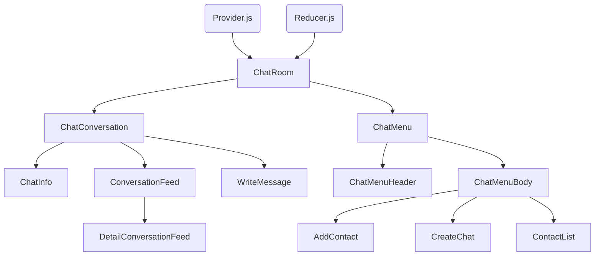

# README

### This project is a React application created using Vite, with dependencies including:

<a href="https://github.com/vitejs/vite-plugin-react-swc">@vitejs/plugin-react-swc</a> uses <a href="https://swc.rs/" rel="nofollow">SWC</a> for Fast Refresh

* Websockets to connect with AWS Server
* Hooks: useReducer, useState, useContext
* Semantic CSS

# Components tree

